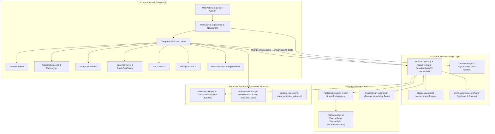

# FastZen 🧘‍♂️
### Modern Intermittent Fasting Tracker & Metabolic Wellness Companion for Android

[](https://developer.android.com)
[](https://kotlinlang.org)
[](https://developer.android.com/jetpack/compose)
[](https://m3.material.io)
[-orange?style=for-the-badge)](https://developer.android.com/about/dashboards)
[-brightgreen?style=for-the-badge)](https://developer.android.com)
[](LICENSE)
[](CONTRIBUTING.md)

---

**FastZen** is a clean, privacy-first Android application designed following **Google's Modern Android Architecture (MAD)** guidelines. Crafted entirely with **Jetpack Compose** and **Material Design 3**, FastZen empowers users through science-backed intermittent fasting protocols, real-time cellular renewal tracking (autophagy), electrolyte regulation, mindful hydration, and comprehensive metabolic analytics.

---

## 🏛️ System Architecture

FastZen adheres to Google's official **Guide to App Architecture**, utilizing **Single Activity Architecture** and **Unidirectional Data Flow (UDF)** to ensure high maintainability, zero memory leaks, and seamless state restoration.



---

## 🧬 Biological Fasting Lifecycle State Machine

FastZen computes cellular states dynamically by comparing current timestamps against the user's active fast duration, progressing through evidence-based human metabolic zones:

```mermaid
stateDiagram-v2
    [*] --> FedState : Fast Started (0h)
    
    FedState --> EarlyFast : 4 Hours Elapsed
    note right of FedState
        <b>Digestive Processing</b>
        Insulin elevated; blood glucose normalizes.
    end note

    EarlyFast --> Ketosis : 12 Hours Elapsed
    note right of EarlyFast
        <b>Glycogen Depletion</b>
        Insulin drops; liver glycogen conversion begins.
    end note

    Ketosis --> DeepKetosis : 18 Hours Elapsed
    note right of Ketosis
        <b>Fat Oxidation (Lipolysis)</b>
        Active ketone production; mental clarity surge.
    end note

    DeepKetosis --> Autophagy : 24 Hours Elapsed
    note right of DeepKetosis
        <b>Peak Fat Burn & Cellular Repair</b>
        Mitochondrial biogenesis and insulin reset.
    end note

    Autophagy --> ExtendedFast : 48 Hours+
    note right of Autophagy
        <b>Autophagy & Stem Cell Renewal</b>
        Misfolded protein recycling & immune rejuvenation.
    end note

    Autophagy --> FastCompleted : User Ends Fast
    DeepKetosis --> FastCompleted : User Ends Fast
    Ketosis --> FastCompleted : User Ends Fast
    EarlyFast --> FastCompleted : User Ends Fast
    ExtendedFast --> FastCompleted : User Ends Fast

    FastCompleted --> JournalEntry : Launch BreakFastJournalDialog
    JournalEntry --> [*] : Stored in HistoryScreen
```



---

## ✨ Key Features & Capabilities

| Feature Category | Description | Highlights |
| :--- | :--- | :--- |
| ⏱️ **Circular Timer Engine** | Interactive Canvas-rendered circular progress indicator with dynamic metabolic zone detection. | Live biological milestone notifications, retro start-time adjuster, custom 1–72h targets, 16:8, 18:6, 20:4, OMAD, and Monk protocols. |
| 🧂 **Electrolyte & Hydration Tracker** | Dedicated hydration gauge with quick-log increments and prolonged fasting electrolyte manager. | Sodium, Potassium, Magnesium tracking based on Snake Juice / Cole Robinson scientific formulas for extended fasting safety. |
| 📊 **Advanced Analytics & Heatmaps** | Visual consistency metrics, weekly completion trends, total hours fasted, and milestone streaks. | Clean Material 3 vector-rendered bar charts, stage distributions, and achievement badge progression. |
| 📝 **Mindful Journal & Fast Breakdown** | Post-fast reflection modal capturing refeeding meal choices, mental clarity, physical energy, and symptoms. | Retrospective logging, symptom tagging (Headache, Energized, Lightheaded), and historical review. |
| 📚 **Fasting Knowledge Base** | Curated multi-category evidence repository addressing common fasting hurdles and myths. | Searchable FAQs covering coffee/tea rules, autophagy timelines, insulin spikes, safe refeeding, workouts, and female hormones. |
| 🎨 **Material Design 3 & OLED Canvas** | Adaptive dark and light themes with 5 distinct zen-inspired palette variations. | Midnight Zen (True OLED black), Emerald Sage, Violet Lotus, Rosewood Sunset, and Ocean Drift. |
| 🛡️ **Privacy-First & Offline-Ready** | 100% on-device data persistence with zero mandatory cloud accounts or external telemetry. | Fully functional offline; supports Android Cloud Backup and scoped data extraction rules. |

---

## 📂 Repository Directory Tree

```
fastzen/
├── app/
│   ├── build.gradle.kts                # Module build configurations & AdMob placeholders
│   ├── proguard-rules.pro              # R8 / ProGuard optimization & reflection rules
│   └── src/main/
│       ├── AndroidManifest.xml         # Manifest definitions & permissions
│       ├── java/com/example/
│       │   ├── MainActivity.kt         # Single Activity hosting Jetpack Compose root
│       │   ├── data/                   # Data access, storage & FAQ repositories
│       │   │   ├── FastZenStorage.kt   # Local state persistence wrapper
│       │   │   ├── FastingFaqRepository.kt
│       │   │   └── Faq*.kt             # Curated metabolic & nutrition guides
│       │   ├── model/                  # Domain models & state definitions
│       │   │   └── FastingModels.kt    # FastingStage, FastingStyle, ElectrolyteProtocol
│       │   ├── ui/                     # Declarative Jetpack Compose UI Screens
│       │   │   ├── AdBanner.kt         # AdMob banner component with safety filters
│       │   │   ├── AnalyticsScreen.kt  # Fasting analytics & progress charts
│       │   │   ├── BreakFastJournalDialog.kt # Post-fast reflection & logging modal
│       │   │   ├── ElectrolyteTrackerView.kt  # Scientific electrolyte intake tracker
│       │   │   ├── FaqScreen.kt        # Interactive knowledge base screen
│       │   │   ├── HistoryScreen.kt    # Historical fast records & journal view
│       │   │   ├── MainLayout.kt       # Root scaffold, navigation bar, top bar
│       │   │   ├── SettingsScreen.kt   # Preferences, themes, notifications
│       │   │   ├── TimerScreen.kt      # Real-time circular fasting timer
│       │   │   ├── TrackingScreen.kt   # Hydration, weight, and symptom logging
│       │   │   ├── WelcomeOnboardingScreen.kt # Introductory guided walkthrough
│       │   │   └── theme/              # Material 3 Color schemes, Type, and ThemeManager
│       │   └── util/                   # Utility helpers
│       │       ├── AppConfig.kt        # Environment configuration flags
│       │       ├── BadgeManager.kt     # Achievement system logic
│       │       ├── DeviceUtils.kt      # Hardware & emulator detection
│       │       ├── NotificationHelper.kt # Push notifications & channel manager
│       │       └── ZenSoundHelper.kt   # Audio feedback & gong synthesizer
│       └── res/                        # Vector drawables, mipmaps, and XML configs
├── gradle/                             # Gradle wrapper artifacts & version catalogs
├── build.gradle.kts                    # Root build configuration
├── settings.gradle.kts                 # Plugin management and project repositories
└── README.md                           # Project documentation & guidelines
```

---

## 🚀 Getting Started

### Prerequisites

- **Android Studio**: Iguana (2023.2.1) / Jellyfish (2023.3.1) / Ladybug or newer
- **JDK**: OpenJDK 17 or higher
- **Android SDK**: API Level 34 installed
- **Device / Emulator**: Android 8.0 (API 26) or newer

### Installation & Build

1. **Clone the repository:**
   ```bash
   git clone https://github.com/KUSHALMN/FastZen-Fasting-Tracker.git
   cd FastZen-Fasting-Tracker
   ```

2. **Open in Android Studio:**
   - Launch Android Studio, select **Open**, and navigate to the cloned `FastZen-Fasting-Tracker` folder.
   - Allow Gradle to perform the initial sync.

3. **Build the Debug APK via CLI:**
   ```bash
   # On macOS / Linux:
   ./gradlew assembleDebug

   # On Windows (PowerShell):
   .\gradlew.bat assembleDebug
   ```

4. **Install onto a connected device or running emulator:**
   ```bash
   .\gradlew.bat installDebug
   ```

---

## 🔒 Privacy, Security & Google Play Compliance

- **No Medical Claims**: Educational content in FAQs and stage markers follows medical disclaimer recommendations. FastZen serves as a personal lifestyle tracker, not a medical diagnostic device.
- **On-Device Data Storage**: User health data (fast durations, hydration levels, body weight) is stored locally on the user's device via private application sandboxing.
- **Advertising Transparency**: Google AdMob adheres to Family Policy requirements, with automated emulator detection preventing invalid traffic generation during development.

---

## 👨‍💻 Author & Creator

FastZen is entirely architected, designed, and developed by **Kushal M.N** as a solo developer:

| Developer | Role & Responsibilities | GitHub Profile | Scope |
| :--- | :--- | :--- | :--- |
| **Kushal M.N** | **Sole Creator & Lead Android Developer**<br>Jetpack Compose UI/UX, State Architecture, AdMob Optimization, Data Persistence & Android Platform Services | [@KUSHALMN](https://github.com/KUSHALMN) | 💻 `100% Codebase`, 🎨 `Design & Theming`, 🏗️ `Architecture`, 🚀 `All Maintenance` |

---

## 🤝 Contributing

Contributions are welcomed and celebrated! To contribute:

1. **Fork** the repository.
2. Create your feature branch (`git checkout -b feature/mindful-breathing`).
3. Commit your changes following [Conventional Commits](https://www.conventionalcommits.org) (`git commit -m 'feat(timer): add mindful breathing vibration intervals'`).
4. Push to your branch (`git push origin feature/mindful-breathing`).
5. Open a **Pull Request** targeting the `main` branch.

Please review our code style guidelines ensuring all Jetpack Compose functions follow official naming conventions and Kotlin style guides.

---

## 📄 License

This project is licensed under the **MIT License** — see the [LICENSE](LICENSE) file for complete details.

---

<p align="center">
  Crafted with 🧘‍♂️ Zen & Purpose for healthy, mindful living.
</p>
